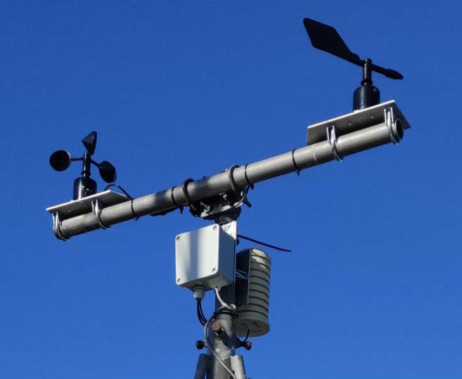

# WX-station-LoRa-WiFi
⚠️ Latest software versions : 
2025-08-28 Changed NTP library version to 1.7. Localy as PIO is at older 1.6 version. 
2024-12-18 Web server is now asynchrone. New parameters added to set data display rate. 
2024-12-07 Some small bug corrections. 
2024-10-18 Some small corrections, new Webserver librairies 
2024-08-17 Corrections to avoid uptime overflow after about 46 days (Utils::DelayToString) 
2024-04-08 Added APRS LoRa fallback & NTP DST bug correction 

An APRS LoRa weather station with a TTGO T3 module.

More details in the Wiki : https://github.com/tk5ep/WX-station-LoRa-WiFi/wiki 

This is the description of a Weather station build with a TTGO T3 module that can :
- measure pressure, temperature, humidity, wind speed, wind direction, wind gust speed & direction, rain fall.
- transmit datas to APRS in LoRa or APRS-IS, to Wunderground & MQTT broker via WiFi.
- display datas on the OLED screen.
- display a Web page with data display.
- upgrade via OTA.

The pressure, temperature & humidity are measured with a BME280 or SHT31 sensor multi-sensor on the i2C bus.
The wind direction and speed are measured in ModBus mode via RS485, allowing long distance measurements.
The rain fall is measured with a rain bucket gauge.

**Hardware :**

The used module is a TTGO T3 v1.6.1 bought on Aliexpress at the [LilyGo shop](https://lilygo.aliexpress.com/store/2090076), i can only recommend.  
The wind speed and direction sensors are a ModBus RS485 version that can be found [here on Aliexpress](https://www.aliexpress.com/item/1005005500304078.html) 
There are different models for RS485 sensors. Be aware that the library used here has been written by me for the above sensors. 
The main difference is that the ModBus address is set by writing into a register, not sending a ModBus command.  
The temperature, humidity and pressure sensor is a very classical BME280 board found on Aliexpress.The SHT31 works also.  

**Sofware :**

The software has been written for PlatformIO using the Arduino framework. 
The libraries are common, except for the wind sensors which has been written by me.

All settings are done in editing the settings.h file. 

More details on [my Web page](https://egloff.eu/index.php?option=com_content&view=article&id=283) 
